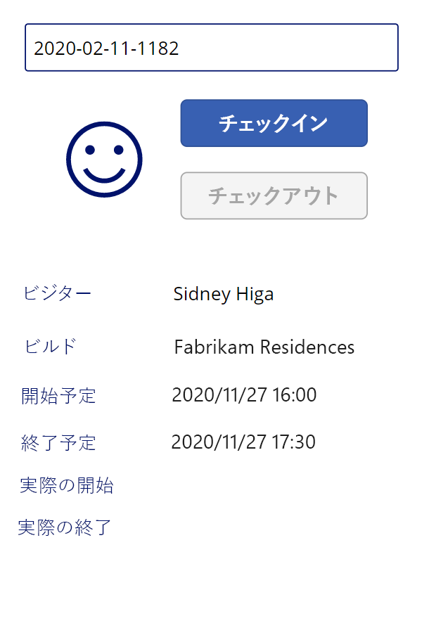

---
lab:
    title: '課題 3: キャンバスアプリの構築方法、パート2'
    module: 'モジュール 3: Power Apps の使用を開始'
---

# モジュール 3: Power Apps の使用を開始
## 課題 2: キャンバス アプリの作成方法、パート2

# シナリオ

ベローズ カレッジは、キャンパス内に複数の建物を持つ教育機関です。キャンパス訪問は現在、紙の記録簿に記録されています。情報は一貫してキャプチャされず、キャンパス全体の訪問に関するデータを収集して分析する手段はありません。 

キャンパス管理は、建物へのアクセスがセキュリティ担当者によって制御され、すべての訪問がホストによって事前登録され、記録される必要がある訪問者登録システムを近代化したいと考えています。

このコース全体を通して、アプリケーションを構築するとともに自動化を行って、ベローズ・カレッジの管理担当者とセキュリティ担当者がキャンパス内の建物へのアクセスを管理および制御できるようにします。 

このラボのパート 2 では、セキュリティ担当者が建物の入り口で使用する Power Apps キャンバス アプリを設計、作成して、訪問者を迅速に確認して登録します。

# ハイレベルのラボ手順

キャンバス アプリをデザインするには、以下の概要に従います。

-   電話フォーム ファクターを使用してアプリを作成する
-   データ ソースとして Common Data Service に接続する
-   入力 (訪問者コード) をキャプチャし、訪問者レコードを見つける
-   訪問者情報を表示するために フォーム ビューアー コントロールを構成する
-   「Common Data Service」 ビューを使用してギャラリーを設定する
-   訪問者のチェックインとチェックアウトのプロセスを処理する

## 前提条件

* **モジュール 0 ラボ 0 - ラボ環境の検証**の完了
* **モジュール 2 ラボ 1 - Common Data Service の概要**の完了

## 始める前に考慮すべきこと

-   セキュリティ担当者はどのような情報にすばやくアクセスする必要がありますか?
-   訪問者コードが無効な場合に起こるべきこと
-   訪問者が予定時間外に到着した場合に起こるべきこと 

# 演習 \#1: セキュリティ キャンバス アプリを作成する

**目的:** この演習では、キャンバス アプリケーションを作成します。

## タスク \#1: キャンバス アプリを作成する

1.  「Campus Management」 ソリューションを開きます。

    -   <https://make.powerapps.com> にサインインします

    -   右上に表示されている環境が演習環境でない場合は、「**環境**」 を選択します。 

    -   「**ソリューション**」 を選択します。

    -   「**Campus Management**」 ソリューションをクリックして開きます。
    
2.  新しいキャンバス アプリケーションを作成する

    -   「**新規**」 をクリックし、 を選択する **App \| キャンバス アプリ \| 携帯電話フォーム ファクター**。
        これにより、新しいウィンドウでアプリケーション エディターが開きます。
        
    -   「パワー アプリ スタジオへようこそ」ダイアログが表示された場合は、**「スキップ」** をクリックします。
    
3.  キャンバス アプリを保存する

    -   「**ファイル**」 をクリックして 「**名前を付けて保存**」 を選択します。
    
    -   「**クラウド**」 が選択されているかどうかを確認します。 
    
    -   「名前」 に「**「姓」 キャンパス セキュリティ**」 と入力し、「**保存**」 をクリック します。
        
    -   アプリに戻るには、左上の**戻る**矢印 (「Power Apps」 の下) をクリックします。

3.  データ ソースへの接続 (訪問)

    -   「**ビュー \**」 をクリックする **| データ ソース**
    
    -   「**すべてのエンティティを表示**」 をクリックする
    
    -   「**訪問**」 を選択し、「**アプリのデータ**」 セクションの下に 「訪問」 エンティティが表示されるまで待ちます。
    
4.  進行中の作業を保存するには、「**ファイル**」 をクリックし、次に 「**保存**」 をクリックします戻る矢印を使用して、アプリに戻ります。

## タスク \#2: 訪問者情報を表示する

1.  検索ボックスを追加する

    -   左側の ナビゲーションバーの 「**ツリー ビュー**」 タブを選択します。
    
    -   **Screen1** を選択します。
    
    -   「**挿入**」 タブに移動します。
    
    -   「**テキスト**」 をクリックし、「**テキスト入力**」 を選択します。
    
2.  テキスト入力オブジェクトを編集する

    -   テキスト入力オブジェクトを選択したまま、「**既定値**」 プロパティでテキストを選択し、値をクリアします。
    
    -   「**HintText**」 プロパティを選択し、値として `"訪問者コードを入力してください"` を入力する (二重引用符を含む)
    
    -   ツリー ビュー (TextInput1) のコントロール名の横にある **...** をクリックし、「**名前の変更**」 を選択し、名前を `textCode` に変更します。
    
3.  フォーム ビューを追加する

    -   「**挿入**」 タブで 「**フォーム**」 をクリックし、「**表示**」 を選択する
   
    -   サイズ ハンドルを使用して、フォームを検索テキスト ボックスの下に配置する
   
    -   「**DataSource**」 プロパティを選択し、「**訪問**」 を選択します
   
    -   「プロパティ」 ウィンドウで、「**レイアウト**」 として 「**横**」 を選択する

4.  フォーム ビューを編集する

    -   「**フィールドの編集**」 をクリックする
   
    -   「**フィールドの追加**」 をクリックし、次のフィールドを追加します。**実際の終了**、**実際の開始**、**建物**、**スケジュールされた終了**、**スケジュールされた開始**、**訪問者**
   
    -   「**追加**」 を押下する
   
    -   「**名前**」 フィールドと 「**作成日時**」 フィールドの両方を削除する
   
    -   リスト内のフィールド カードをドラッグして、選択したフィールドの順序を変更します。推奨される順序は次のとおりです。訪問者、建物、スケジュールされた開始、スケジュールされた終了、実際の開始、実際の終了
   
    -   **X** をクリックして、フィールド ウィンドウを閉じる
   
5.  フォーム ビューを選択したまま、「プロパティ」 ペインの 「詳細」 タブを選択します。「**Item**」 プロパティを選択し、`LookUp(Visits, Code = textCode.Text)` と入力する 

6.  進行中の作業を保存するには、「**ファイル**」 をクリックし、次に 「**保存**」 をクリックします戻る矢印を使用して、アプリに戻ります。

7.  アプリのテストの準備を行う

    -   ソリューションを含むブラウザー タブに切り替える
   
    -   「**訪問**」 エンティティを選択する
   
    -   「**データ**」 タブを選択する
   
    -   現在のビュー名、 **アクティブな訪問**をクリックして、右上のビュー セレクタを開きます
   
    -   ビューを **「すべての取引先企業」** に変更します。
   
    -   実績開始日または実績終了の値がない訪問レコードを見つけます。この訪問の**コード**を選択してコピーします。

8.  アプリをテストする

    -   アプリでブラウザー タブに切り替え、**F5** キーを押すか、右上隅にある 「**再生**」 アイコンをクリックしてアプリをプレビューします。
   
    -   コピーした値を検索テキストボックスに貼り付け、レコードがフォームに表示されていることを確認する
   
9.  検索テキストボックスの内容をクリアします。
   
10.  **ESC** を押して、実行中のアプリを終了します。

## タスク \#3: 「チェックイン」 ボタンと 「チェックアウト」 ボタンを追加する

このタスクでは、ユーザーがアクセスをチェックインしてチェックアウトするためのボタンを作成します。 

1. コントロール全体で再利用するために、検索結果を変数に保存する

    * **textCode** コントロールを選択する
   
    * プロパティ ペインで、**「詳細設定」** タブを選択し、 **「OnChange」** プロパティを選択します。
   
    * 式 `Set(Visit, LookUp(Visits, Code = textCode.Text))` を入力する
    
    > これにより、ユーザーが textCode 検索ボックスで検索を行ったときに、訪問がグローバル変数に保存されます。これにより、検索式全体を再入力することなく、アプリ全体で変数 *Visit* を使用できます。

2. チェックイン ボタンを追加する

   * 「**挿入**」 タブを選択する
   
   * 「**ボタン**」 をクリックする
   
   * プロパティ ペインで、ボタンの 「**テキスト**」 プロパティを "`チェックイン`" に変更します (既存の引用符内で入力できます)。
   
   * ツリー ビュー (ボタン 1) のボタン名の横にある **...** をクリックし、「**名前の変更**」 を選択し、名前を `CheckInButton` に変更する

3. チェックアウト ボタンを追加する   

   * 「挿入」 タブの 「**ボタン**」 をクリックして、別のボタンを挿入します
   
   * プロパティ ペインで、ボタンの 「**テキスト**」 プロパティを "`チェックアウト`" に変更します (既存の引用符内で入力できます)。
   
   * ボタンの名前を `CheckOutButton` に変更する
   
   * ボタンを検索ボックスの下に配置し、「**チェックイン**」 を 「**チェックアウト**」 の上に配置します。 
   
## タスク \#4: 訪問データに応じてボタンを有効または無効にします。

訪問レコードが見つかった (空白ではない) 場合、レコードの状態がアクティブで、訪問がまだ開始されていない場合、つまり、実際の開始値が空白の場合は、「**チェック イン**」 ボタンを有効にします。

1. **チェックイン ボタン**を選択し、「プロパティ」 タブのボタンの 「**DisplayMode**」 プロパティをクリックします

2. 関数バーに、以下の式を入力します。

      ```
      If(!IsBlank(Visit) 
      && Visit.Status = 'Status (Visits)'.Active
      && IsBlank(Visit.'Actual Start'),
          DisplayMode.Edit,
          DisplayMode.Disabled
      )
      ```

   式は次のようにブレークダウンできます。

   * **!IsBlank(Visit)** -  訪問記録が見つかりました
   * **&&** - logical AND operator
   * **Visit.Status = 'Status (Visits)'.Active** レコードのステータスが*アクティブ*
   * **IsBlank(Visit.'Actual Start')** -  アクティブな開始フィールドにはデータがありません
   * **DisplayMode.Edit, DisplayMode.Disabled** -  上記の条件が満たされると、ボタンは編集可能になります。そうでない場合、ボタンは無効のままになります。

訪問レコードが見つかった (空白ではない) 場合、レコードの状態がアクティブで、訪問が既に開始されている場合、つまり、実際の開始値が空白でない場合は、「**チェックアウト**」 ボタンを有効にします。

3. 「チェックアウト」 ボタンを選択し、「プロパティ」 タブのボタンの 「**DisplayMode**」 プロパティをクリックします。

4. 関数バーに、以下の式を入力します。

     ```
     If(!IsBlank(Visit) 
     && Visit.Status = 'Status (Visits)'.Active
     && !IsBlank(Visit.'Actual Start'),
         DisplayMode.Edit,
         DisplayMode.Disabled
     )
     ```

5. 進行中の作業を保存するには、「**ファイル**」 をクリックし、次に 「**保存**」 をクリックします戻る矢印を使用して、アプリに戻ります。

6. **F5** を押してアプリを実行します。 

7. 両方のボタンを無効にする必要があります。前にコピーしたコード値を入力し **Tab** を押してフォーカスをテキストボックスから離します。「**チェックイン**」 ボタンが有効になります。 

8. 検索ボックスの内容をクリアします。

9. **ESC** を押して、実行中のアプリを終了します。

## タスク \#5: チェックインとチェックアウトのプロセスを完了します

チェックインとチェックアウトのプロセスを実行するには、Common Data Service 訪問データを次のように更新する必要があります。

* 訪問者がチェックインする際に、「*実際の開始*」 フィールドを現在の日時に設定します
* 訪問者がチェックアウトするとき、「*実際の終了*」 フィールドを現在の日時に設定します。 
* チェックアウト後、レコード ステータスを訪問が完了したことを示す非アクティブに設定します

1. 「**チェックイン**」 ボタンを選択します。

2. 「詳細」 タブの 「**OnSelect**」 プロパティに次の式を設定します。

   ```
   Patch(
       Visits,
       Visit,
       {'Actual Start': Now()}
   );
   Refresh([@Visits]);
   Set(Visit, LookUp(Visits, Code = textCode.Text));
   ```

   この式には次の項目が含まれます。

   * **Patch(Visits, Visit, {'Actual Start': Now()});**.*Patch* メソッドは **Visits** エンティティ、**Visit** 変数で識別されるレコード (つまり現在の訪問数) を更新します。この式では、 「*Actual Start*」 フィールドの値を現在の日時 (*Now()* メソッド) に設定します。
   * **Refresh([@Visits]);**.この式により、基準になる値が変更された場合に訪問レコードを更新します
   * **Set(Visit, LookUp(Visits, Code = textCode.Text));** この式により Common Data Service からの新しいデータで *Visit* 変数を更新します。
   
   > ユーザーがこのボタンをクリックすると、訪問の実際の開始時刻が現在の日付と時刻に設定され、データが更新されます。

3. 「**チェックアウト**」 ボタンを選択します。

4. 「詳細設定」 タブの 「**OnSelect**」 プロパティを次の式に設定します。

   ```
   Patch(
       [@Visits],
       Visit,
       {
           'Actual End': Now(),
           Status: 'Status (Visits)'.Inactive
       }
   );
   Refresh([@Visits]);
   Set(Visit, LookUp(Visits, Code = textCode.Text));
   ```

   ユーザーがこのボタンをクリックすると、実績終了が現在の日時に設定され、訪問レコードの状態が非アクティブに設定され、データが更新されます。

5. 進行中の作業を保存するには、「**ファイル**」 をクリックし、次に 「**保存**」 をクリックします**戻る**矢印を使用して、アプリに戻ります。

6. 「**F5**」 キーを押すか、「再生」 ボタンをクリックしてアプリを実行します。前にコピーしたコード値を入力し **Tab** を押してフォーカスをテキストボックスから離します。「**チェックイン**」 ボタンが有効になります。

7. 「**チェックイン**」 ボタンを押します。次のことが起こります。

   * **実際の開始日**フィールドには、現在の日時が設定されます。
   
   * 「**チェックイン**」 ボタンが無効になっています
   
   * 「**チェックアウト**」 ボタンが有効になっています

8. 「**チェックアウト**」 ボタンを押します。

   * 「**実際の終了**」 には現在の日時が設定されます
   
   * 両方のボタンが無効になっています

9. 検索ボックスの内容をクリアします。

10. **ESC** を押して、実行中のアプリを終了します。

## タスク \#6: ビジュアル インジケーターを追加します

視覚的なインジケーターが提供されると、モバイル アプリの使いやすさが大幅に向上します。このタスクでは、訪問者をチェックインまたはチェックアウトできるかどうかを示すアイコンを追加します。

1. 「**挿入**」 タブを選択する

2. 「**アイコン \**」 を選択します **| 追加**。 この時点では、値を動的にするので、どのアイコンを選択しても構いません。

3. アイコンのサイズを変更して、ボタンの左側に配置します

4. アイコンの 「詳細設定」 タブで、「**アイコン**」 プロパティを選択し (「デザイン」 セクション内) に次の式を入力します。

   ```
   If(
      CheckInButton.DisplayMode = DisplayMode.Disabled 
   && CheckOutButton.DisplayMode = DisplayMode.Disabled,
       Icon.EmojiFrown,
       Icon.EmojiSmile
   )
   ```

5. 進行中の作業を保存するには、「**ファイル**」 をクリックし、次に 「**保存**」 をクリックします**戻る**矢印を使用して、アプリに戻ります。

6. **F5** を押してアプリを実行します。前にコピーしたコード値を入力し **Tab** を押してフォーカスをテキストボックスから離します。アイコンに困った顔の絵文字が表示されていることを確認します。

7. 以前に使用されていない別のコード値を検索します (実績開始日または実績終了値を含めるべきではありません)。 

    > 前のタブに移動して、作成した訪問の 1 つから別のコードをコピーできます。以前に作成した**キャンパス スタッフ** アプリを実行して、新しい訪問レコードを作成することもできます。このコードに笑顔の絵文字が表示されているアイコンを確認します。

起動中のアプリは次のようになります。



8. **ESC** を押して、実行中のアプリを終了します。

## タスク #7: アプリを発行します

1. ブラウザーでキャンパス セキュリティ アプリを開いたままにする必要があります。ない場合、「**キャンパス セキュリティ**」 アプリを選択し、「**編集**」 をクリックします。

2. 「**ファイル \**」 を選択する **| 発行** 

3. この 「**このバージョンの発行**」 を選択する

# 課題

* 訪問コードの手動入力を避ける
* 訪問の建物検証を追加します
* 訪問の実際の時間と訪問のスケジュールされた時間の検証を追加します (早すぎる、遅すぎるなど)
* 例えば、電子メールの表示や訪問者の検証, 建物へのアクセスを拒否する理由など、訪問の詳細なステータスを追加します
* 1 つのキャンパス訪問中に複数の建物 / 会議 / チェック。たとえば、ある日にキャンパスを訪れ、訪問している日の異なる時間帯に複数の建物でスタッフと出会う場合があります。*予定*エンティティをソリューションに取り込むことを検討しますか?
