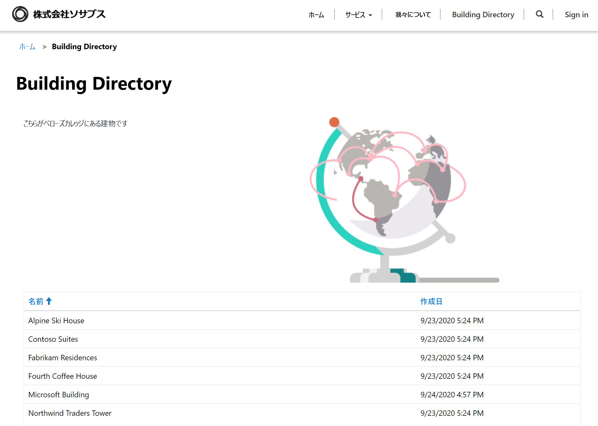

---
lab:
    title: 'ラボ 5: Power Apps ポータルを作成する方法'
    module: 'モジュール 3: Power Apps の使用を開始'
---

# モジュール 3: Power Apps の使用を開始

## ラボ 4: Power Apps ポータルを作成する方法

### 重要なお知らせ (2020 年 11 月発効):
Common DataService は Microsoft Dataverse に名前が変更されました。Microsoft Dataverse の一部の用語が更新されました。たとえば、エンティティはテーブルになりました。Dataverse データベースのフィールドとレコードは、列と行と呼ばれるようになりました。

アプリケーションがユーザー エクスペリエンスを更新している間、エンティティ (現在は **テーブル**)、フィールド (現在は**列**)、レコード (現在は**行**) などの Microsof tDataverse の用語への参照が古くなっている可能性があります。ラボで作業するときは、このことを覚えておいてください。間もなくコンテンツを完全に最新の状態にする予定です。 

詳細および影響を受ける用語の完全なリストについては、「[Microsoft Dataverseとは?](https://docs.microsoft.com/ja-jp/powerapps/maker/common-data-service/data-platform-intro#terminology-updates)」をご覧ください。

# シナリオ

ベローズ カレッジは、キャンパス内に複数の建物を持つ教育機関です。キャンパス訪問は現在、紙の記録簿に記録されています。情報は一貫してキャプチャされず、キャンパス全体の訪問に関するデータを収集して分析する手段はありません。

キャンパス管理者は、訪問者にキャンパス内の建物に関する情報を提供したいと考えています。訪問者は、Power Apps ポータルを使用して作成される Web サイトで建物リストを表示できます。

このラボでは、Power Apps ポータルをプロビジョニングし、キャンパス内の建物の一覧を表示するポータル Web ページを作成します。

# ハイレベルのラボ手順

Power Apps ポータルをデザインするには、以下の概要に従います。

* Dataverse 環境で Power Apps ポータルをプロビジョニングする
* 建物のリストを表示する Web ページを作成および構成する
* 新しいテーマを作成してポータルに適用する

## 前提条件

* **モジュール 0 ラボ 0 - ラボ環境の検証**の完了
* **モジュール 2 ラボ 1 - Microsoft Dataverse の概要**の完了

## 始める前に考慮すべきこと

* Power Apps ポータル アプリは、常に空のアプリケーションではなくテンプレートから開始されます。ポータルはモジュール 0 のラボ 0 で作成されている必要があります。ポータルをプロビジョニングすると、すでにページ、メニュー、および既定のテーマが表示されます。 

# 演習 \#1: ポータル Web ページの作成

**目的:** この演習では、一部の静的コンテンツと、Dataverse の建物の一覧を表示する新しい Web ページを作成します。

## タスク \#1: ポータルに移動

1.  <https://make.powerapps.com> に移動します。

2.  練習環境にいることを確認してください。そうでない場合は、右上で環境を変更してください。

3.  「**アプリ**」 をクリックします

4.  **ポータル**の**種類**を持つアプリを見つける

5.  アプリ名をクリックしてポータルを開きます

    > ウェルカム メッセージが表示されたポータル Web サイトのランディング ページにリダイレクトする必要があります。ポータルをナビゲートして、ポータルをプロビジョニングしたときに既定で作成されたものを確認します。 

## タスク \#2: Web ページを作成する

1.  Power Apps ポータル スタジオを開く

    -   <<https://make.powerapps.com> にサインインします (タブで開いたままの場合があります)

    -   「**アプリ**」 を選択します
    
    -   **ポータル**の**種類**を持つアプリを見つける

    -   ポータル アプリ名の右側にある省略記号 (**...**) をクリックし、「**編集**」 を選択します

    > これで、Power Apps ポータル スタジオに入ります。ここで、ポータル コンテンツを変更および作成できます。

2.  新しいページを作成する

    -   コマンド バーで 「**新しいページ**」 を選択します

    -   「**固定レイアウト**」 にマウスを合わせて、「**タイトル付きページ**」 を選択します

3.  プロパティ ペインの 「**表示**」 で、**名前**を**新しいページ (1)** から`Building Directory`に変更します

4.  「**部分 URL**」 で値を`building-directory`に変更し、Tab キーを押します (自動保存を開始するため)

    > ページのタイトルに、**構築ディレクトリ**と表示されます
    
## タスク \#3: 静的コンテンツの追加

1.  Web ページにセクションを追加する

    -   キャンバス (Web ページを表示する領域) で、「**ページのコピー**」 セクションを選択します。これは、ページの中央にある 2 つの文章の周りの大きなボックスです。

    -   ツールベルト (左側) で、「**コンポーネント**」 アイコンを選択します

    -   「**セクション レイアウト**」 領域から 「**2 列セクション**」 を選択します

2.  静的テキストの追加

    -   キャンバス (Web ページを表示する領域) で、左側の列を選択します

    -   ツールベルト (左側) で、「**コンポーネント**」 アイコンを選択します

    -   「**ポータル コンポーネント**」 領域から 「**テキスト**」 を選択します

    -   新しいテキスト領域に、次のテキストを入力します。
          ```
          The following is the building directory.
          ```
    -   編集したテキスト ボックスの上にあるテキスト ボックスを選択し、コマンド バーの 「**削除**」 をクリックして既定のテキストを削除します。

3. 画像を追加する

    -   キャンバス (Web ページを表示する領域) で、右の列を選択します

    -   ツールベルト (左側) で、「**コンポーネント**」 アイコンを選択します

    -   「**ポータル コンポーネント**」 領域から 「**画像**」 を選択します

    -   プロパティ ウィンドウで、「**画像の選択**」 をクリックします。**Product A.png** を検索して選択します
    
    -   プロパティ ペインで、「**書式設定**」 セクションのドロップダウンをクリックし、「**幅**」 を 70% に変更します (必ず % を入力します)。必要に応じて画像のサイズ変更を行うことができます。

4.  「**Web サイトを参照**」 をクリックして、これまでのページを表示します。  メイン メニューに 「**ディレクトリのビルド**」 オプションがあることに注意してください。

    > ポップアップを許可するようにブラウザーを構成する必要がある場合があります。

## タスク \#4: リスト コンポーネントを追加する

1.  前のタブに移動し、手順 #2 に進みます。使用できない場合は、以下の手順に従ってこの場所に戻ります。

    -   <<https://make.powerapps.com> にサインインします (タブで開いたままの場合があります)

    -   **ポータル**の**種類**を持つアプリを見つける

    -   省略記号 (**...**) をクリックし、「**編集**」 を選択します
    
    -   ツールベルト (左側) で、「**ページ**」 オプションを選択します 

    -   前に作成した 「**構築ディレクトリ**」 ページを見つけて選択します
    
2.  「ディレクトリのビルド」 ページにリスト コンポーネントを追加する

    -   2 列のセクションを選択します。

    -   ツールベルト (左側) で、「**コンポーネント**」 アイコンを選択します

    -   「**セクション レイアウト**」 領域から 「**1 列セクション**」 を選択します (セクションは Web ページの画像とテキストの下に表示されます)

    -   キャンバス上の新しい列セクションを選択します

    -   ツールベルト (左側) で、「**コンポーネント**」 アイコンを選択します

    -   「**ポータル コンポーネント**」 領域から 「**リスト**」 を選択します (リスト コンポーネントが新しいセクションに表示されます)
    
3.  リスト コンポーネントの構成

    -   キャンバス上のリスト コンポーネントを選択します

    -   プロパティ ウィンドウ (右側) で、「**名前**」 フィールドの `Buildings List` に入力します

    -   「**テーブル**」 フィールドで、ドロップダウン リストから 「**建物 (bc_building)**」 を選択します

    -   「**ビュー**」 で 「**アクティブな建物**」 を選択します

    -   残りの既定の設定をそのままにする
    
4.  「**Web サイトの参照**」 をクリックしてページを表示します。 

    > Dataverse の建物のリストが Web ページに表示されます。

# 演習 \#2: ポータル テーマの変更

**目的:** この演習では、ポータルの配色を変更する新しいテーマを作成します。 

## タスク #1: テーマの適用と編集

1.  前のタブに移動し、手順 #2 に進みます。使用できない場合は、以下の手順に従ってこの場所に戻ります。

    -   <<https://make.powerapps.com> にサインインします (タブで開いたままの場合があります)

    -   **ポータル**の**種類**を持つアプリを見つける

    -   省略記号 (**...**) をクリックし、「**編集**」 を選択します
    
2.  基本的なテーマを適用およびカスタマイズする

    -   ツールベルト (左側) で、「**テーマ**」 アイコンを選択します
    
    -   「**基本テーマを有効にする**」 のトグルをクリックして、この機能をオンにします。
    
    -   いずれかのプリセットで、省略記号 (**...**) をクリックし 「**カスタマイズ**」 を選択します
    
    -   基本テーマのコピーが作成されました。 
    
    -   プロパティ ウィンドウで、色を変更し、これらの変更がポータルに与える影響を調べます。
    
    -   テーマの名前を変更する
    
3.  コマンド バーで 「**同期構成**」 をクリックします

アプリのレイアウトは、次の構造のようになります。



# 課題

* 建物名を表示するだけの建物の別のビューを作成します。変更を確認するには、ポータル スタジオから 「**Web サイトの参照**」 を選択する必要があります。
* ツールベルトで 「**テーマ**」 アイコンをクリックし、カスタム テーマの CSS を編集します。
* 「**フォーム**」 コンポーネントを使用してページを作成し、「**リスト**」 コンポーネントを変更して、フォームで Dataverse 行を追加または編集します。
* 「**リスト**」 コンポーネントの 「**設定**」 で、「**エンティティのアクセス許可**」 を有効にすると、データはどうなりますか?
* ポータル スタジオで、ソース コード エディター アイコン `</>` を選択してページ ソースを表示します。HTML に慣れている場合は、いくつかの変更を加えて結果を表示します。
