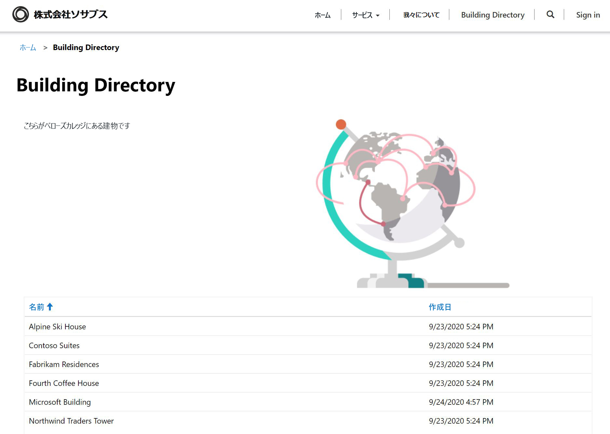

---
lab:
    title: 'ラボ 5: Power Apps ポータルを作成する方法'
    module: 'モジュール 3: Power Apps の使用を開始'
---

# モジュール 3: Power Apps の使用を開始

## 課題 4: Power Apps ポータルを作成する方法

# シナリオ

ベローズ カレッジは、キャンパス内に複数の建物を持つ教育機関です。キャンパス訪問は現在、紙の記録簿に記録されています。情報は一貫してキャプチャされず、キャンパス全体の訪問に関するデータを収集して分析する手段はありません。

キャンパス管理者は、訪問者にキャンパス内の建物に関する情報を提供したいと考えています。訪問者は、Power Apps ポータルを使用して作成される Web サイトで建物リストを表示できます。

このラボでは、Power Apps ポータルをプロビジョニングし、キャンパス内の建物の一覧を表示するポータル Web ページを作成します。

# ハイレベルのラボ手順

Power Apps ポータルをデザインするには、以下の概要に従います。

* Common Data Service 環境で Power Apps ポータルをプロビジョニングする
* 建物のリストを表示する Web ページを作成および構成する
* 新しいテーマを作成してポータルに適用する

## 前提条件

* **モジュール 0 ラボ 0 - ラボ環境の検証** の完了
* **モジュール 2 ラボ 1 - Common Data Service の概要** の完了

## 始める前に考慮すべきこと

* Power Apps ポータル アプリは、常に空のアプリケーションではなくテンプレートから開始されます。ポータルをプロビジョニングすると、すでにページ、メニュー、および既定のテーマが表示されます。

# 演習 \#1: Power Apps ポータルのプロビジョニング

**目標:** この演習では、環境内で、World Wide Web 上のどこからでもアクセスできる Power Apps ポータルをプロビジョニングします。

## タスク \#1: Power Apps ポータルのプロビジョニング

1.  新しいポータル アプリを作成します。

    -   <https://make.powerapps.com> にサインインします

    -   右上に表示されている 「**環境**」 が演習環境でない場合は、「環境」 を選択します。 

    -   「**自分のアプリを作成する**」 の下の 「**空白からポータル**」 パネルをクリックします

2.  新しいポータルの詳細を提供する

    -   ポータル**名**として「**Bellows College Visitors**」と入力してください

    -   一意の URL を指定します。**something**.powerappsportals.com (名前が取られている場合は別のものを選択してください) 

    -   基本ポータル**言語**の選択

    -   「**作成**」 をクリックします

3. このポータル プロビジョニング プロセスは、30 分から 45 分かかり任意の場所で実行できます。  しばらくお待ちください。

タスク \#2: ポータルに移動
--------------------------------

1.  ポータルがプロビジョニングされたときに通知を <https://make.powerapps.com> で受け取ります

2.  新しいポータルを開く

    -   「**アプリ**」 をクリックします

    -   **ポータル**の**種類**を持つアプリを見つける

    -   アプリ名をクリックします

3.  ウェルカム メッセージが表示されたランディング ページを含むポータル Web サイトにリダイレクトする必要があります

演習 \#2: ポータル Web ページの作成
===============================

**目標:** この演習では、一部の静的コンテンツと、Common Data Service の建物の一覧を表示する新しい Web ページを作成します。

タスク #1: Web ページを作成する
--------------------------------

1.  Power Apps ポータル スタジオを開く

    -   <<https://make.powerapps.com> にサインインします (タブで開いたままの場合があります)

    -   **ポータル**の**種類**を持つアプリを見つける

    -   省略記号 (**...**) をクリックし、「**編集**」 を選択します

2.  これで、Power Apps ポータル スタジオに入ります。ここで、ポータル コンテンツを変更および作成できます。

3.  新しいページを作成する

    -   コマンド バーで 「**新しいページ**」 を選択します

    -   「**固定レイアウト**」 にマウスを合わせて、「**タイトル付きページ**」 を選択します

4.  ページのプロパティを変更する

    -   プロパティ ウィンドウの 「**表示**」 の 「**新しいページ (1)**」 の 「**名前**」 を 「**構築ディレクトリ**」 に変更し、Tab キーを押します (自動保存を開始します) 

    -   ページのタイトルに、**構築ディレクトリ**と表示されます

    -   「**部分 URL**」 で値を 「**building-directory**」 に変更します (自動保存を開始するには、Tab キーを押します) 

タスク #2: 静的コンテンツの追加
--------------------------------

1.  Web ページにセクションを追加する

    -   キャンバス (Web ページを表示する領域) で、「**ページのコピー**」 セクションを選択します。これは、ページの中央にある 2 つの文章の周りの大きなボックスです。

    -   ツールベルト (左側) で、「**コンポーネント**」 アイコンを選択します

    -   「**セクション レイアウト**」 領域から 「**2 列セクション**」を選択します

2.  静的テキストの追加

    -   キャンバス (Web ページを表示する領域) で、左側の列を選択します

    -   ツールベルト (左側) で、「**コンポーネント**」 アイコンを選択します

    -   「**ポータル コンポーネント**」 領域から 「**テキスト**」 を選択します

    -   新しいテキスト領域に、次のテキストを入力します。
          ```
          The following is the building directory.
          ```
    -   編集したテキスト ボックスの上にあるテキスト ボックスを選択し、コマンド バーの 「**削除**」 をクリックして既定のテキストを削除します。

3. 画像を追加する

    -   キャンバス (Web ページを表示する領域) で、右の列を選択します

    -   ツールベルト (左側) で、「**コンポーネント**」 アイコンを選択します

    -   「**ポータル コンポーネント**」 領域から 「**画像**」 を選択します

    -   プロパティ ウィンドウで、「**画像の選択**」 をクリックします。**Product A.png** を検索して選択します
    
    -   プロパティ ウィンドウで、「書式設定」 セクションのドロップダウンをクリックし、「**幅**」 を 70% に変更します (必ず % を入力します)。必要に応じて画像のサイズ変更を行うことができます。

4.  「**Web サイトを参照**」 をクリックして、これまでのページを表示します。  メイン メニューに 「**構築ディレクトリ**」 オプションがあることに注意してください。

タスク #3: リスト コンポーネントを追加する
--------------------------------

1.  Power Apps ポータル スタジオを開く

    -   <https://make.powerapps.com> にサインインします (タブで開いたままの場合があります)

    -   **ポータル**の**種類**を持つアプリを見つける

    -   省略記号 (**...**) をクリックし、「**編集**」 を選択します
    
2.  前に作成した既存のページを編集する

    -   ツールベルト (左側) で、「**ページ**」 オプションを選択します 

    -   前に作成した 「**構築ディレクトリ**」 ページを見つけて選択します
    
3.  リスト コンポーネントを追加する

    -   ツールベルト (左側) で、「**コンポーネント**」 アイコンを選択します

    -   「**セクション レイアウト**」 領域から 「**1 列セクション**」 を選択します (セクションは Web ページの画像とテキストの下に表示されます) 

    -   キャンバス上の新しい列セクションを選択します

    -   ツールベルト (左側) で、「**コンポーネント**」 アイコンを選択します

    -   「**ポータル コンポーネント**」 領域から 「**リスト**」 を選択します (リスト コンポーネントが新しいセクションに表示されます) 
    
4.  リスト コンポーネントの構成

    -   キャンバス上のリスト コンポーネントを選択します

    -   プロパティ ウィンドウ (右側) で、「**名前**」 フィールドの 「**建物リスト**」 に入力します

    -   「**エンティティ**」 フィールドで、ドロップダウン リストから 「**建物**」 を選択します

    -   「**ビュー**」 で 「**アクティブな建物**」 を選択します

    -   残りの既定の設定をそのままにする
    
5.  「**Web サイトの参照**」 をクリックしてページを表示します。Common Data Service の建物のリストが Web ページに表示されます。

演習 \#3: ポータル テーマの変更
===============================

**目標:** この演習では、ポータルの配色を変更する新しいテーマを作成します。 

タスク #1: テーマの適用と編集
--------------------------------

1.  Power Apps ポータル スタジオを開く

    -   <https://make.powerapps.com> にサインインします (タブで開いたままの場合があります)

    -   **ポータル**の**種類**を持つアプリを見つける

    -   省略記号 (**...**) をクリックし、「**編集**」 を選択します
    
2.  基本的なテーマを適用およびカスタマイズする

    -   ツールベルト (左側) で、「**コンポーネント**」 アイコンを選択します
    
    -   「**基本テーマを有効にする**」 のトグルをクリックして、この機能をオンにします。
    
    -   いずれかのプリセットで、省略記号 (**...**) をクリックし 「**カスタマイズ**」 を選択します 
    
    -   基本テーマのコピーが作成されました。 
    
    -   プロパティ ウィンドウで、色を変更し、これらの変更がポータルに与える影響を調べます。
    
    -   テーマの名前を変更する
    
3.  変更内容を保存します

    -   コマンド バーで 「**同期構成**」 をクリックします


アプリのレイアウトは、次の構造のようになります。



# 課題

* 建物名を表示するだけの建物の別のビューを作成します。変更を確認するには、ポータル スタジオから 「**Web サイトの参照**」 を選択する必要があります。
* ツールベルトで **テーマ** アイコンをクリックし、カスタム テーマの CSS を編集します。 
* 「**フォーム**」 コンポーネントを使用してページを作成し、「**リスト**」 コンポーネントを変更して、フォームで Common Data Service レコードを追加または編集します。   
* 「**リスト**」 コンポーネントの 「**設定**」 で、「**エンティティのアクセス許可**」 を有効にすると、データはどうなりますか?     
* ポータル スタジオで、ソース コード エディター アイコン `</>` を選択してページ ソースを表示します。HTML に慣れている場合は、いくつかの変更を加えて結果を表示します。
