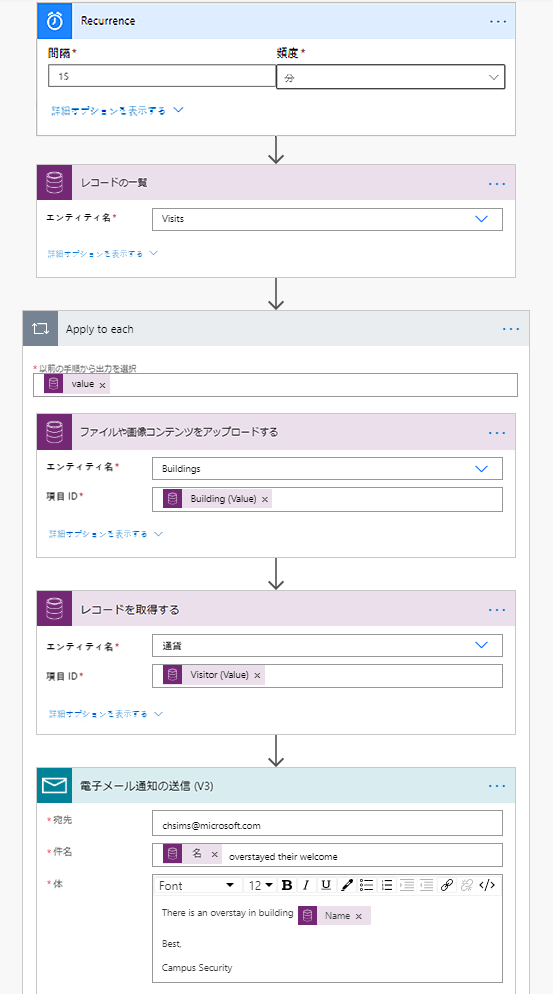

---
lab:
    title: '課題 6: 自動化ソリューションの構築方法'
    module: 'モジュール 4: Power Automate の開始'
---

# モジュール 4: Power Automate の開始
## 課題: 自動化されたソリューションのビルド方法

## シナリオ

ベローズ カレッジは、キャンパス内に複数の建物を持つ教育機関です。キャンパスの訪問者は現在、紙の日誌に記録されています。情報は一貫してキャプチャされず、キャンパス全体の訪問に関するデータを収集して分析する手段はありません。 

キャンパス管理は、建物へのアクセスがセキュリティ担当者によって制御され、すべての訪問がホストによって事前登録され、記録される必要がある訪問者登録システムを近代化したいと考えています。

このコース全体を通して、アプリケーションを構築するとともに自動化を行って、ベローズ・カレッジの管理担当者とセキュリティ担当者がキャンパス内の建物へのアクセスを管理および制御できるようにします。 

このラボでは、キャンパス管理のさまざまな部分を自動化する Power Automate フローを作成します。 

# ハイレベルのラボ手順

プロジェクトの完了に必要な要件は次のとおりです。

* 各訪問者に割り当てられた一意のコードは、訪問前に訪問者が利用できるようにする必要があります。
* セキュリティ担当者は、予定されたタイムスロットにオーバーステイしている訪問者の通知を受け取る必要があります。

## 前提条件

* **モジュール 0 ラボ 0 - ラボ環境の検証**の完了
* **モジュール 2 ラボ 1 - Common Data Service の概要**の完了
* **モジュール 3 ラボ 2 - キャンバス アプリの構築方法、パート 2** (テスト用) で作成した、キャンパス スタッフ アプリ
* **モジュール 3 ラボ 4 - モデル駆動型アプリの構築方法** (テスト用) の個人用電子メール アドレスで作成した John Doe の連絡先

## 始める前に考慮すべきこと

-   訪問者コードの最適な分布メカニズムは何ですか?
-   オーバーステイを測定し、厳格なポリシーを実施する方法は?

# 演習 \#1: 訪問通知フローを作成します

**目的:** この演習では要件を実装する Power Automate フローを作成します。訪問者には、訪問に割り当てられた一意のコードを含む電子メールが送信されます。

## タスク \#1: フローの作成

1.  「Campus Management」 ソリューションを開きます。

    -   <https://make.powerapps.com> にサインインします

    -   **環境**を選択します

    -   「**ソリューション**」 を選択します。

    -   「**Campus Management**」 ソリューションをクリックして開きます。

2.  「**新規**」 をクリックして 「**フロー**」 を選択します。これにより、Power Automate フロー エディターが新規ウィンドウに開きます。

3. 「*最新*」 を検索して、「**Common Data Service (現在の環境)**」 を選択します。

4. 「**レコードが作成、更新、または削除されたとき**」 のトリガーを選択します。

   * **トリガー条件**に 「**作成**」 を選択します
   
   * **エンティティ名**に 「**訪問**」 を選択する
   
   * **範囲**に 「**組織**」 を選択する
   
   * トリガー ステップで、省略記号 (**...**) をクリックし、「**名前の変更**」 をクリックします。このトリガーの名前を **「訪問が作成されたとき」** に変更します。これは良い方法なので、あなたと他のフロー エディタは、詳細に至ることなく、ステップの目的を理解することができます。

5.  「**新しいステップ**」 をクリックします。この手順は、メールを含む訪問者情報を取得するために必要です。

6. 「*最新*」 を検索して、「**Common Data Service (現在の環境)**」 を選択します。

7. 「**レコードの取得**」 アクションを選択します。 

   * **エンティティ名**として 「**連絡先**」 を選択する
   
   * 「**アイテム ID**」 フィールドで、動的コンテンツ リストから 「**訪問者 (値)**」 を選択します。
   
   * このアクションで、省略記号 (**...**) をクリックし、「**名前の変更**」 をクリックします。このアクションの名前を **「訪問者を取得」** に変更します。これは良い方法なので、あなたと他のフロー エディタは、詳細に至ることなく、ステップの目的を理解することができます。

8. 「**新しいステップ**」 をクリックします。これは、訪問者にメールを作成して送信する手順です。

9. 「*メール*」 を検索し、「**メール**」 コネクタを選択 し、「**メール通知を送信する**」 アクションを選択する 

   * このアクションを使用するための利用規約に同意するように求められた場合は、「**同意する**」 をクリックします。
   
   * 「**送信先**」 フィールドを選択し、動的コンテンツ リストから 「**電子メール**」 を選択します。「**訪問者の取得**」 ヘッダーの下にあることに注意してください。これは、前の手順で検索した訪問者に関連する電子メールを選択していることを意味します。 

   * 「**件名**」 フィールドに「**Bellows College への予定訪問**」と入力します。

   * **メール本文**に次のテキストを入力します。  
        
        > 動的コンテンツは、フィールドが括弧で囲まれた場所に配置する必要があります。最初にすべてのテキストをコピーして貼り付けてから、動的コンテンツを正しい場所に追加することをお勧めします。
   
        ```
        {First Name} 様、

        現在、{Scheduled Start} から {Scheduled End} まで Bellows Campus を訪問する予定です。

        セキュリティ コードは {Code} です。共有しないでください。訪問中にこのコードを生成する必要があります。

        よろしくお願いします。

        キャンパス管理
        Bellows College
        ```
   
10.  上部にある**無題**フロー名を選択し、名前を `訪問通知` に変更します

11. **「保存」** を押します。

    次のタスクのために、このフロー タブを開いたままにします。フローはおおよそ次のようになります。


## タスク \#2: フローを検証して、有効化します

1.  ブラウザーで新しいタブを開き、<https://make.powerapps.com> に移動します

2.  「**アプリ**」 をクリックし、作成した**キャンパス スタッフ** アプリを選択します

3.  このタブを開いたまま、フローを使用して前のタブに戻ります。 

4.  コマンド バーで、「**テスト**」 をクリックします。「**トリガー アクションを実行する**」 を選択し、「**保存してテスト**」 を選択します。

5.  フロー タブを開いたまま、**キャンパス スタッフ** アプリで前のタブに戻ります。

6.  「**+**」 キーを押して新しい訪問記録を追加します

7.  **名前**として「**John Doe**」と入力し、任意の**建物**を選択します。

8.  **訪問者**として 「**John Doe**」 を選択します

9.  「**スケジュールされた開始日**」 と 「**スケジュールされた終了日**」 で将来の任意の日付を選択します。

10.  **チェックマーク** アイコンを押して、新しい訪問を保存します

11.  フローをテスト中のままにして、前のタブに戻ります。フローが実行されているのを監視します。エラーが発生した場合は、戻って上記の例とフローを比較してください。電子メールが正常に送信されると、受信トレイに届きます。 

12.  コマンド バーの戻る矢印をクリックします

13.  「**詳細**」 セクションで、「**状態**」 が 「**オン**」 に設定されていることを確認してください。これは、フローをオフにするまで、新しい訪問が作成されるたびに、フローが実行されることを意味します。フローが実行されるたびに、**28 日間の実行履歴**リストにフローが追加されます。

14.  コマンド バーの 「**オフにする**」 をクリックして、フローをオフにします。このオプションを表示するには、省略記号 (**...**) を押す必要がある場合があります。

15.  このウィンドウを閉じます。

# 演習 2: セキュリティ スイープ フローの作成

**目的:** この演習では要件を実装する Power Automate フローを作成します。セキュリティ スイープは 15 分ごとに実行され、訪問者のいずれかが予定時間を超過した場合、セキュリティが通知されます。

## タスク #1: レコードを取得するフローを作成する

1. 「Campus Management」 ソリューションを開きます。

   -   <https://make.powerapps.com> にサインインします

   -   「**環境**」 を選択します

   -   「**ソリューション**」 を選択します。

   -   「**Campus Management**」 ソリューションをクリックして開きます。

2. 「**新規**」 をクリックして 「**フロー**」 を選択します。これにより、Power Automate フロー エディターが新規ウィンドウに開きます。

3. 「*繰り返し*」を検索し、「**スケジュール**」 コネクタを選択してから、「**繰り返し**」 トリガーを選択します。

4. 「**間隔**」 を 「**15 分**」 に設定します

5. 「**新しい手順**」 をクリックします。「*最新*」 を検索して、「**Common Data Service (現在の環境)**」 を選択します。「**レコードの一覧表示**」 アクションを選択します。

   * 「**エンティティ名**」 に「**訪問**」と入力します
   
   * 「**詳細オプションを表示**」 をクリックします

   * 「**フィルタ クエリ**」 として次の式を入力します

   ```
     statecode eq 0 and bc_actualstart ne null and bc_actualend eq null and Microsoft.Dynamics.CRM.OlderThanXMinutes(PropertyName='bc_scheduledend',PropertyValue=15)
   ```
   
   * 分割するには:
       * **statecode eq 0** は、アクティブな訪問をフィルター処理します (ステータスがアクティブに等しい場合)
       * **bc_actualstart ne null** は、実際の開始に値がある訪問、つまりチェックインがあった訪問に検索を制限します
       * **bc_actualend eq null** は、検索をチェックアウトがなかった訪問に制限します (実際の終了には値がありません) 
       * **Microsoft.Dynamics.CRM.OlderThanXMinutes(PropertyName='bc_scheduledend',PropertyValue=15)** は、15 分以上前に完了していた状態の訪問を制限します。

   * このアクションで、省略記号 (**...**) をクリックし、「**名前の変更**」 をクリックします。このアクションの名前を **「15 分以上前に終了したアクティブな訪問を一覧表示する」** に変更します。これは良い方法なので、あなたと他のフロー エディタは、詳細に至ることなく、ステップの目的を理解することができます。

6.  「**新しい手順**」 をクリックします。「*適用」*」 を検索し、各アクションに対し 「**適用**」 を選択します 

7.  「**以前の手順から出力を選択**」 フィールドのダイナミクス コンテンツから**値**を選択します。**15 分以上前に終了したアクティブな訪問のリスト**の灰色のヘッダーの下にあることに注意してください。これは、前の手順で検索した訪問のリストを選択していることを意味します。 

8.  関連レコードの建物データを取得する

    * 「各ループに適用」 で 「**アクションの追加**」 をクリックします。
    
    * 「*最新*」 を検索して、「**Common Data Service (現在の環境)**」 を選択します。 
    
    * 「**レコードの取得**」 アクションを選択します。
    
    * 「**エンティティ名**」 として「**Buildings**」を選択します
    
    * 動的コンテンツから**アイテム ID** として 「**建物 (値)**」 を選択します
    
    * 「**レコードの取得**」 の横にある **...** をクリックし、「**名前の変更**」 を選択します。ステップ名として「**建物を取得**」と入力します
    
9.  関連レコードの訪問者データを取得する

    * 「各ループに適用」 で 「**アクションの追加**」 をクリックします。
    
    * 「*最新*」 を検索して、「**Common Data Service (現在の環境)**」 を選択します。
    
    * 「**レコードの取得**」 アクションを選択します。
    
    * **エンティティ名**として 「**連絡先**」 を選択する
    
    * 動的コンテンツから**アイテム ID** として 「**訪問者 (値)**」 を選択します
    
    * 「**レコードの取得**」 の横にある **...** をクリックし、「**名前の変更**」 を選択します。ステップ名として「**訪問者を取得**」と入力します
    
11.  電子メールによる通知を送信する

     * 「各ループに適用」 で 「**アクションの追加**」 をクリックします。「**メール接続**」 から 「**電子メールによる通知を送信する**」 アクションを追加します。

12.  「**宛先**」 に電子メール アドレスを入力します

13.  「**件名**」 フィールドに次のように入力します。「**フル ネーム**」 は、**訪問者の取得**手順の動的コンテンツです。

   ```
   {Full Name} は歓迎をオーバーステイします
   ```
   
14.  **本文**フィールドに次の情報を入力します。**名前** は、**構築ステップの取得**からの動的コンテンツです。

   ```
   建物 {Name} にオーバーステイがあります
         
   最高の
         
   キャンパス セキュリティ
   ```

17.  左上隅にあるフロー名 「**無題**」を選択し、 **セキュリティ スイープ**に名前を変更します。

18.  **「保存」** を押します。

    フローはおおよそ次のようになります:



## タスク #2: フローを検証して、有効化します

フローで設定された要件を満たす訪問がある場合、フローは (以前、John Doe の連絡先を作成したときに指定した電子メールに) 電子メールの送信を開始します。

1. 次のような訪問記録があることを確認します。

   1. アクティブなステータスがある
   
   2. スケジュールされた終了が過去 (15 分以上) である
   
   3. 実績開始日には値があります。
   
   > **注**: このデータを表示するには、新しいタブで make.powerapps.com に移動します。左側のペインで 「ソリューション」 をクリックして、ソリューションを検索します。「訪問」 エンティティを選択し、「データ」 タブを選択します。右上隅の 「アクティブな参照」 をクリックしてビュー セレクターを表示し、「すべてのフィールド」 を選択します。
   
2. ソリューションに移動し、**セキュリティ スイープ**フローを見つけます。 **...** をクリックし、「**編集**」 をクリックします。

3. フローが開いたら、「**テスト**」 をクリックします。

4. 「**トリガーのアクションを実行**」 を選択します。

5. 「**テスト**および**フローの実行**」 をクリックします。

6. フローが競合する場合は、「**完了**」 をクリック します。 

7. 「**それぞれに適用**」 を展開し、「**電子メールによる通知の送信**」 の手順を展開します。「**件名**」、「**電子メール本文**」 の値を確認してください。

8. ソリューションに移動し、フローの横にある **...** をクリックして、「**オフにする**」 を選択します。これは、テスト システム上でフローがスケジュールどおりに実行されないようにするためです。

# 課題

* 電子メール本文に 「実際の開始」 と 「スケジュールされた終了」 を追加します。
* メール本文で使いやすい日付形式が使われている事を確実にするには？
* オーバーステイ情報を含むテーブルを生成し、単一のメールのみを送信することは可能ですか?
* 訪問コードのバーコードを生成できますか? それはいつ役に立ちますか?
