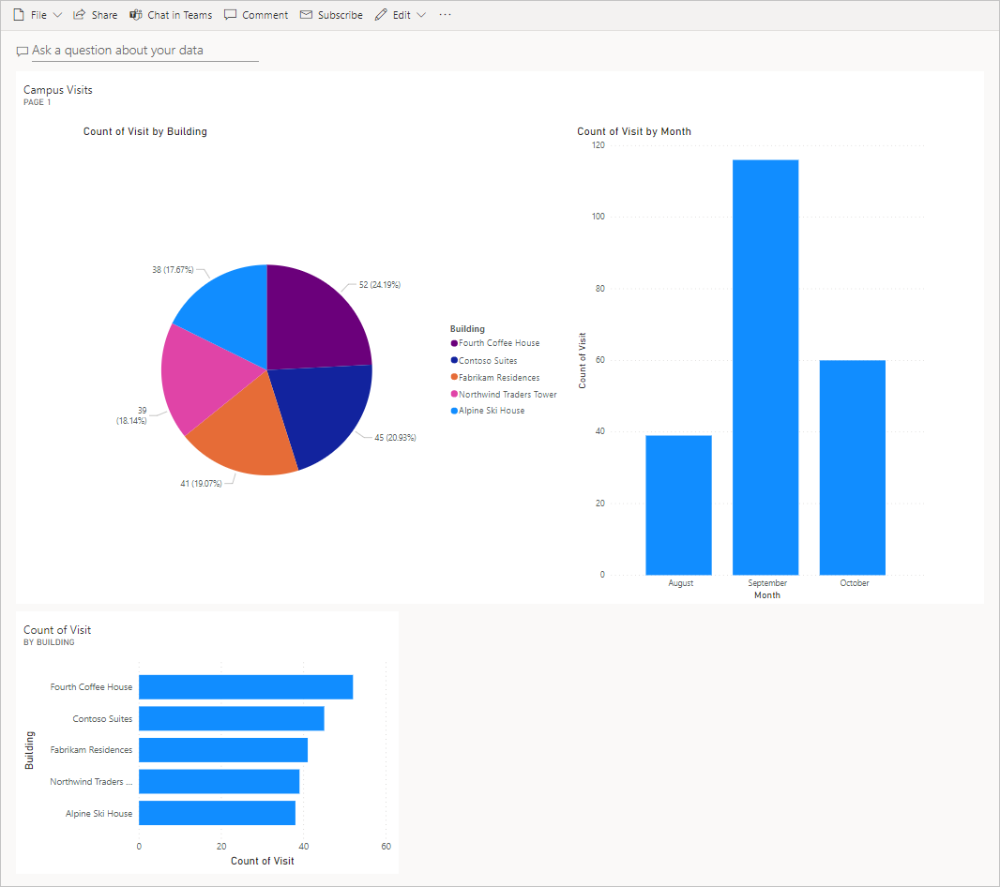

---
lab:
    title: '課題7: 簡単なダッシュボードの構築方法'
    module: 'モジュール 5: Power BI の開始'
---

# モジュール 5: Power BI の開始
## 課題: 簡単なダッシュボードの構築方法

シナリオ
========

ベローズ カレッジは、キャンパス内に複数の建物を持つ教育機関です。キャンパスの訪問者は現在、紙の日誌に記録されています。情報は一貫してキャプチャされず、キャンパス全体の訪問に関するデータを収集して分析する手段はありません。 

キャンパス管理は、建物へのアクセスがセキュリティ担当者によって制御され、すべての訪問がホストによって事前登録され、記録される必要がある訪問者登録システムを近代化したいと考えています。

このコース全体を通して、アプリケーションを構築するとともに自動化を行って、ベローズ・カレッジの管理担当者とセキュリティ担当者がキャンパス内の建物へのアクセスを管理および制御できるようにします。 

このラボでは、キャンパス訪問に関するデータを視覚化する Power BI ダッシュボードをビルドします。

ハイレベルのラボ手順
======================

次の手順に従って Power BI ダッシュボードを設計および作成します。

-   Common Data Service に接続します。 
-   関連レコードについて、ユーザーに分かりやすい説明を含むようにデータを変更する (ルックアップ)
-   キャンパス訪問情報の様々な視覚化を用いたレポートの作成と公開を行います。
-   自然言語クエリを使用して、追加で視覚化を行う
-   Power BI ダッシュボードのモバイル ビューを構築する


## 前提条件

* **モジュール 0 ラボ 0 - ラボ環境の検証** の完了
* **モジュール 2 ラボ 1 - Common Data Service の概要** の完了

始める前に考慮すべきこと
-----------------------------------

-   このレポートが想定しているのは、どのような利用者層でしょうか?
-   利用者はどのようにレポートを活用しますか? 典型的なデバイスを使っていますか? 場所?
-   視覚化するのに十分なデータがありますか?
-   訪問に関するデータを分析するために使用できる特性は何ですか?

演習 \#1: Power BI レポートの作成 
===============================

**目的:** この演習では、Common Data Service データベースのデータに基づいて Power BI レポートを作成します。

タスク \#1: Power BI Desktop のインストール/ Power BI サービスの準備
---------------------------

1.  Power BI Desktop がインストールされていない場合は、[https://aka.ms/pbidesktopstore](https://aka.ms/pbidesktopstore) に移動して、Power BI アプリをダウンロードおよびインストールします。

> 「!重要」
> Microsoft Store を使用して Power BI Desktop のインストールに問題が発生した場合は、[https://aka.ms/pbiSingleInstaller-jpn](https://aka.ms/pbiSingleInstaller-jpn) からダウンロードできるスタンドアロン インストーラを試してください 。

2. **Power BI Desktop が正常にインストールされた場合は、 [タスク \#2](#task-2-prepare-data)に進んでください**。デスクトップ アプリケーションをインストールするためのアクセス許可が不足している場合や、Power BI Desktop の実行または構成に問題がある場合は、以下のタスク手順を完了してから [タスク \#3](#task-3-create-chart-and-time-visualizations)を続行しますが、Power BI Desktop の代わりに課題全体で [https://app.powerbi.com](https://app.powerbi.com) のオンライン Power BI サービスを使用します。 

3. [visits.pbix](../../Allfiles/visits.pbix) をダウンロードして、コンピューターに保存します。

4. [https://app.powerbi.com/](https://app.powerbi.com/) に移動して **「サインイン」** をクリックします。 

5. **「マイ ワークスペース」** をクリックします。 

6. **「データの取得」** ページが表示された場合、**「スキップ」** をクリックします。 

6. **「+ 新規」** を展開し、**「ファイルのアップロード」** を選択します。

7. **「ローカル ファイル」** を選択します

8. 以前にダウンロードした **visits.pbix** ファイルを見つけて選択します。

9. データの読み込みが完了したら、 **訪問**レポートを選択します (タイプが **レポート** に設定されていることに注意してください)。

10. **「編集 (Edit)**」 をクリックします。**「編集」** メニュー項目が表示されていない場合は、「**...**」 をクリックし、**「編集」** を選択します。 

11. [タスク \#3](#task-3-create-chart-and-time-visualizations)に進みます。

タスク \#2: データの準備
---------------------------

1.  組織の URL を確認します。

    * 新しいタブで、https://admin.powerplatform.com から Power Platform 管理センターに移動します。
    
    * 左側のナビゲーション ページで、「実際の環境」 を選択し、新しいターゲット環境を選択します。
    
    * 「**詳細**」 パネルの 「**環境 URL**」 を右クリックし、「**リンクのコピー**」 を選択します。
    
2.  Power BI Desktop を開き、プロンプトが表示されたらサインインします。

2. 「**データの取得**」 を選択します。

3. 「**Power Platform**」 を選択し、「**Common Data Service**」 を選択して、「**接続**」 をクリックします。

4. 先ほどコピーした環境 URL を **「サーバー URL」** フィールドに貼り付け、**「OK」** をクリックします。

5. 「**エンティティ**」 ノード を展開し、「**bc_Building**」 と 「**bc_Visit**」 エンティティを選択して 、「**読込み**」 をクリックします。

6. 左の垂直ツールバーの 「**モデル**」 アイコンをクリックします。

7. **bc_Building** テーブルから **bc_Buildingid** 列 をドラッグして、**bc_Visit** テーブルの **bc_building** 列にドロップします。これにより、Power BI が関連データの表示に使用できる 2 つのエンティティ間のリレーションシップが作成されます。

8. 左側のツールバーの 「**レポート**」 アイコンを選択します。

9. 「**フィールド**」 パネル内の **bc_Visits** ノードを展開します。

10. 「**bc_Visit**」 の横の **...** をクリックし、「**新しい列**」 を選択します。

11. 式を次のような完全な形にさせます

    ```
    Column = RELATED(bc_Building[bc_name])
    ```

    「ENTER」 を押します。これにより、建物名の新しいフィールドが訪問データに追加されます。

12. 作成した 「**列**」 フィールドの横の **...** をクリックし、「**名前の変更**」 を選択します。フィールド名として **Building** を入力します。

13. 「**bc_visitid**」 フィールドの横の **...** をクリックし、「**名前の変更**」 を選択します。フィールド名として「**訪問数**」と入力します。

14. 「**bc_scheduledstart**」 フィールドの横の **...** をクリックし、「**名前の変更**」 を選択します。フィールド名として **起動**を入力します。

15. 「**ファイル**」 を押して進行中の作業を保存します **| 保存** して、選択したファイル名を入力します。

## タスク 3: グラフと時間の視覚化を作成する

1. 「**視覚化**」 パネルの円グラフ アイコンを押して、グラフを挿入します。

2. 「**建物**」 フィールドをドラッグして、「**凡例**」 ボックスにドロップします。

3. 「**訪問数**」 フィールドをドラッグして、「**値**」 ターゲット ボックスにドロップします。

4. コーナー ハンドルで円グラフのサイズを変更し、すべてのグラフ コンポーネントが表示されるようにします。

5. 円グラフの外側にあるレポートをクリックして選択を解除し、「**視覚化**」 ウィンドウで 「積み上げ縦棒グラフ」 を選択します。  

6. 「**訪問数**」 フィールドをドラッグして、「**値**」 ターゲット ボックスにドロップします。

7. 「**開始**」 フィールドをドラッグして、「**軸**のターゲット」 ボックスにドロップします。

8. 「視覚化」 ウインドウで、**日**と**四半期**の横にある  「**x**」 をクリックすると、**年**と**月**の合計のみが表示されます。

9. コーナー ハンドルを使用して、必要に応じてグラフのサイズを変更します。

10. レポートがインタラクティブに動作するかをテストします。

    * 円グラフでさまざまな積み重なったスライスを選択し、時間レポートの変化を見てみましょう。
    
    * 縦棒グラフをクリックします。下矢印を押して 「**ドリルダウン**」 モードをオンにし、列を押して次のレベル (月) にドリルダウンします。  これを行う別の方法では、「**データ/ドリル**」 をクリックします **|** リボンの**次のレベルを展開します**。
    
    * 時間縦棒グラフでさまざまなバーを選択し、円グラフの変更を見てみましょう。
    
11. 「**ファイル**」 を押して進行中の作業を保存します **| 保存** します。

演習 2: Power BI  ダッシュボードを作成する。
================================

## タスク 1Power BI レポートを発行する。

1. リボンの 「ホーム」 タブの 「**発行**」 ボタンを押します。 

2. コピー先として 「**マイ ワークスペース**」 を選択し、「**選択**」 を押します。

3. 公開が完了するまで待ち、「**Power BI で \<name of your report\>.pbix を開く**」 をクリックします。

## タスク #2: Power BI  ダッシュボードを作成する。

1. 前のタスクからレポートを開く必要があります。

2. メニューの 「**ダッシュボードをピン留めする**」 を選択します。レイアウトによっては、追加のメニュー項目を表示するためには **...** を押す必要があります。

3. 「**ダッシュボードにピン留めする**」 プロンプトで、「**新しいダッシュボード**」 を選択します。

4. **ダッシュボード名**として「**「自分の名前」 キャンパス管理**」と入力し、「**ライブをピン留めする**」 を押します。

5. 上部の 「**マイ ワークスペース**」 を選択し、「**「姓」 キャンパス管理**」 ダッシュボードを選択します。 

6. 表示される円グラフと棒グラフがインタラクティブに動作するかをテストします。

## タスク 3: 自然言語を使用した視覚化の追加します。

1. 「**キャンパス管理**」 ダッシュボードで 、上部の 「**データ バーに関する質問**」 を選択します。   

2. Q&A エリアで、**訪問数別に見る建物**と入力します。棒グラフが表示されます。

3. 「**ビジュアルをピン留めする**」 を選択します。

4. 「**既存のダッシュボード**」 を選択し、「**「姓」 キャンパス管理**」 ダッシュボードを選択し、「**ピン**」 を押します。

5. **「Q&A を終了」** をクリックします。

6. 「**「Your Last Name」 キャンパス管理**」 ダッシュボードに移動します。完成すると次のようになるはずです。

    

## タスク #4: 携帯電話ビューを構築し、QR コードでレポートを共有する

1. ダッシュボードで、**「編集 \ 」** を選択します。**| モバイル ビュー**

2. 必要に応じてタイルを並べ替えます。

3. 右上の **「電話ビュー」** をクリックし、「表示」 を **「Web 表示」** に変更します。

4. 上部の **「マイ ワークスペース**」 を選択し、「**レポート」** を選択します。

5. **「編集」** を選択し、「**...**」 を選択します。**\| QR コードを生成します**。

6. モバイル デバイスをお持ちの場合は、iOS と Android の両方のプラットフォームで入手可能な QR スキャナー アプリを使用してコードをスキャンします。(ログインを求められた場合は、ログインします。

7. モバイル デバイス上のレポートを移動して調査します。

# 課題

* キャンパスと建設計画を含むダッシュボードとレポート
* 訪問パターンと傾向を報告および分析
* 滞在時間が長過ぎる訪問者をどう視覚化するか
* 大規模キャンパスでリアルタイムに近い処理を実現するストリーミング Power BI 
